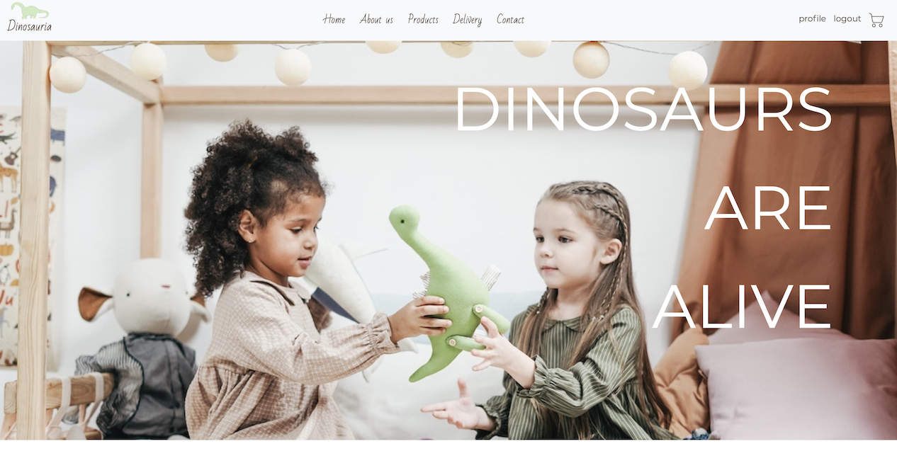

# Mam Głos

See it live: http://ec2-3-16-44-251.us-east-2.compute.amazonaws.com

## Table of contents
* General info
* Technologies

## General info
I've made this project to grasp some more knowledge and practide in django, and how onlineshops could be built. 
I have it on Amazon EC2, as long as I have some free tier to use for it. 
If time allows, there's a lot of features I'd like to add here to practice.  

## Technologies
* Python
* Django2
